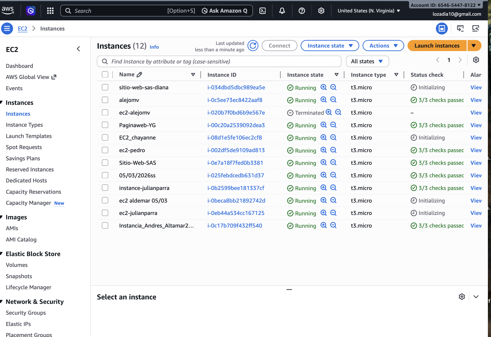
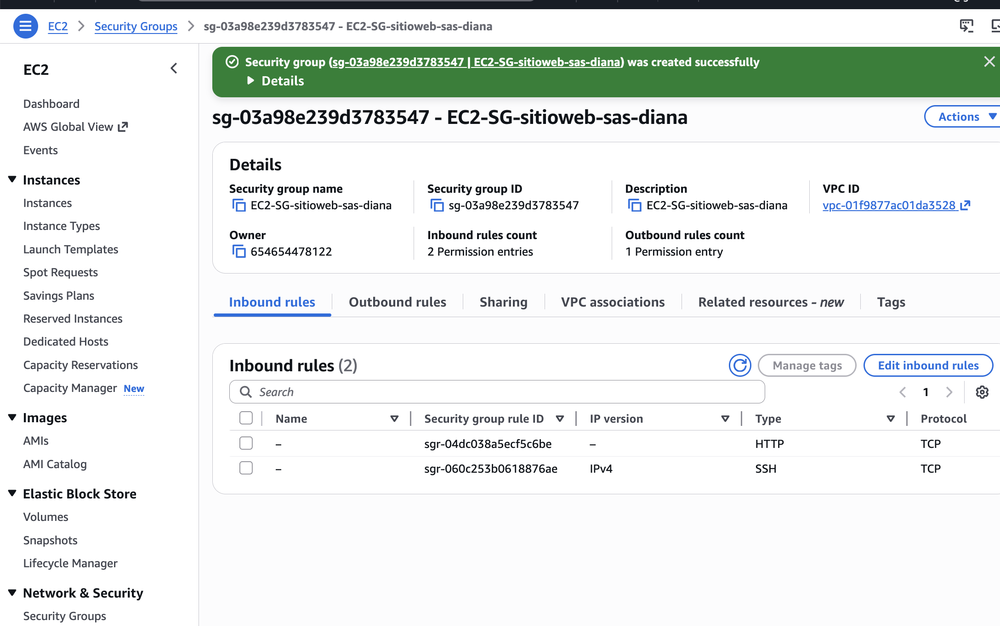
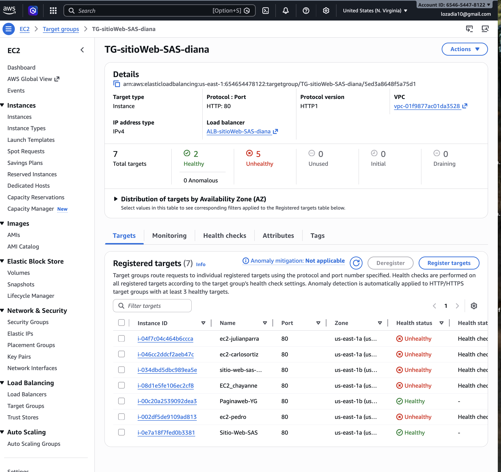
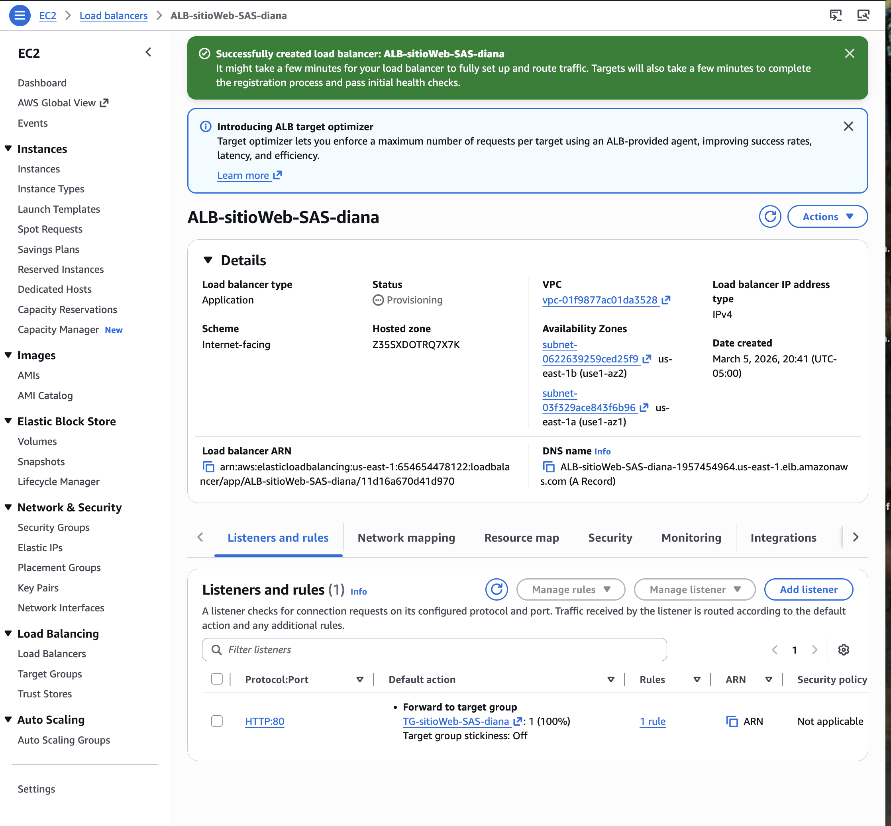
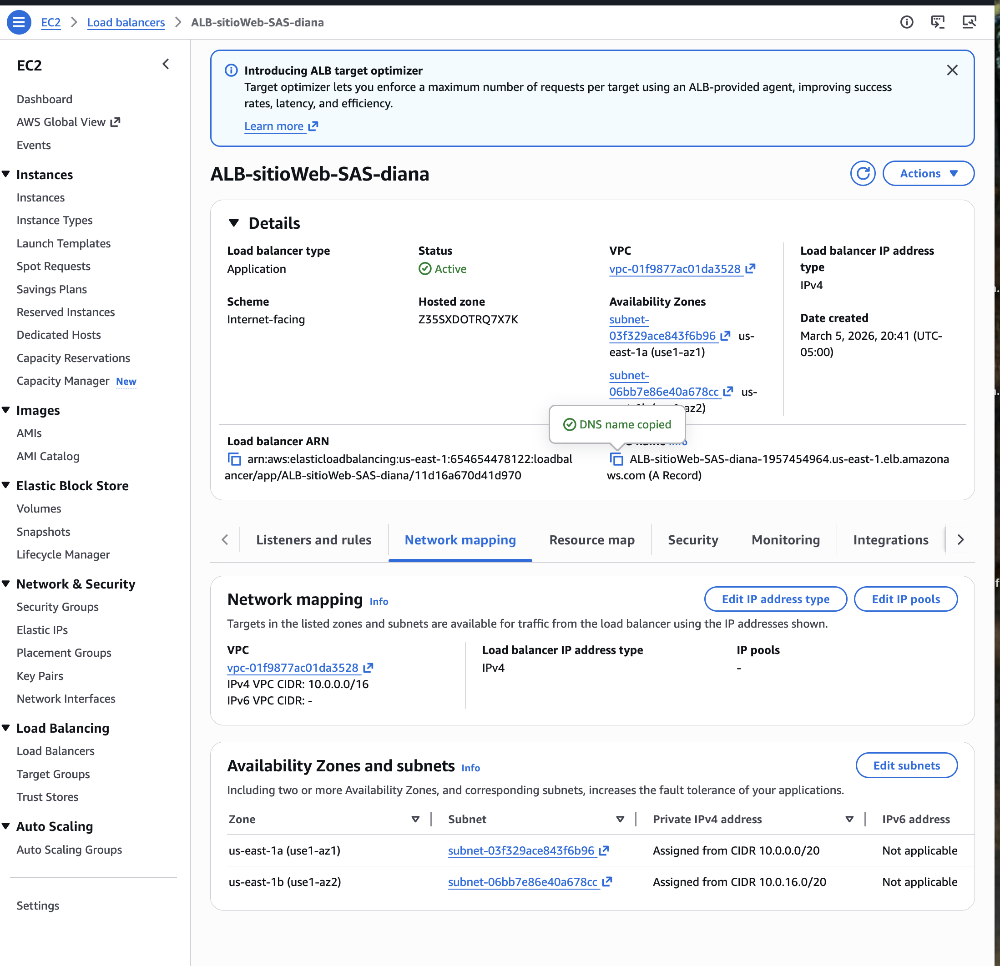
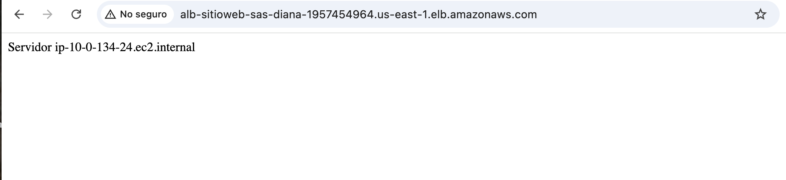

# ⚖️ Laboratorio AWS: Configuración de Application Load Balancer (ALB)

Este laboratorio documenta la implementación de una arquitectura de alta disponibilidad en AWS utilizando un **Application Load Balancer**. El objetivo principal fue establecer un punto único de entrada para el tráfico web y distribuirlo eficientemente entre un grupo de instancias EC2 para garantizar la resiliencia del servicio.

* **Servicios Utilizados:** Amazon EC2, Application Load Balancer (ALB), Target Groups, Security Groups.

---

## 🏗️ 1. Preparación de Infraestructura (EC2)
Para iniciar el laboratorio, aseguré la disponibilidad de las instancias que actuarían como servidores finales. En el panel de control verifiqué que las instancias estuvieran en estado de ejecución y distribuidas en diferentes zonas de disponibilidad para garantizar la redundancia.

> **Evidencia:**
> 

---

## 🛡️ 2. Capa de Seguridad (Security Groups)
Configuré un grupo de seguridad denominado `EC2-SG-sitioweb-sas-diana` para gestionar el tráfico de red de forma segura. Definí las siguientes reglas de entrada:
* **HTTP (Puerto 80):** Permitido desde cualquier origen para habilitar el acceso web público.
* **SSH (Puerto 22):** Habilitado para permitir tareas de administración remota segura.

> **Evidencia:**
> 

---

## 🎯 3. Gestión de Destinos (Target Group)
Creé el Target Group denominado `TG-sitioWeb-SAS-diana`. Este componente es vital para la operación del balanceador, ya que define el conjunto de instancias hacia las cuales se redirigirán las peticiones y realiza monitoreos de salud (*Health Checks*) constantes para asegurar que solo los servidores operativos reciban tráfico.

> **Evidencia:**
> 

---

## 🌐 4. Despliegue del Application Load Balancer (ALB)
Procedí con la creación y configuración del balanceador `ALB-sitioWeb-SAS-diana` bajo un esquema orientado a internet (*Internet-facing*). Durante este proceso, realicé el mapeo de red seleccionando múltiples zonas de disponibilidad para maximizar la resiliencia de la aplicación frente a posibles fallos de infraestructura local.

> **Evidencias del Balanceador:**
> 
> 

---

## 🔍 5. Validación de Resultados
La prueba final consistió en acceder a la URL proporcionada por el DNS del balanceador desde un navegador. La respuesta exitosa confirmó que el ALB está operando correctamente, distribuyendo la carga entre los servidores del Target Group y ocultando la complejidad de la infraestructura interna al usuario final.

> **Evidencia de Prueba:**
> 

---

## 📝 Conclusiones 

* **Alta Disponibilidad:** Comprendí que el Application Load Balancer es la pieza clave para construir sistemas tolerantes a fallos, permitiendo que la aplicación siga disponible incluso si una instancia falla.
* **Escalabilidad y Flexibilidad:** El uso de **Target Groups** facilita enormemente el escalado de la infraestructura, permitiendo añadir o remover servidores de forma transparente para el cliente.
* **Punto Único de Gestión:** La centralización del acceso a través de un DNS único del balanceador simplifica la administración del tráfico externo y fortalece la postura de seguridad de la red.

