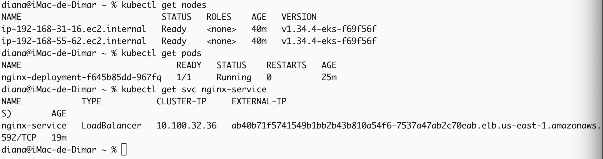
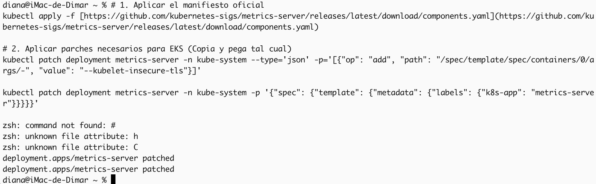
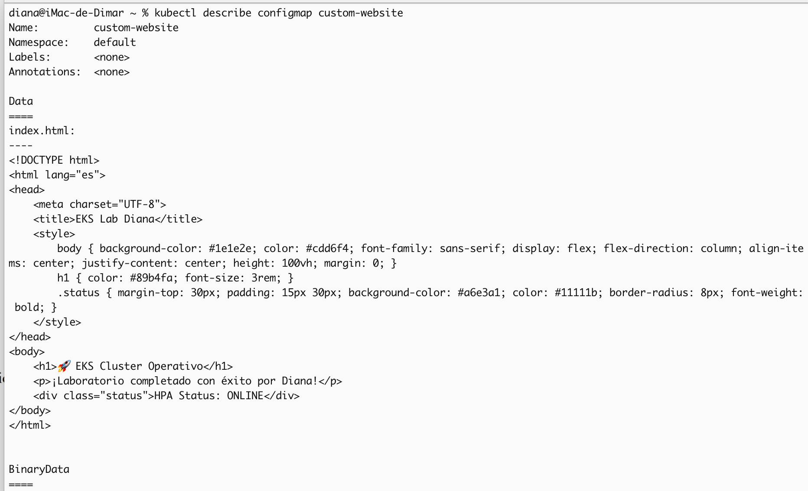
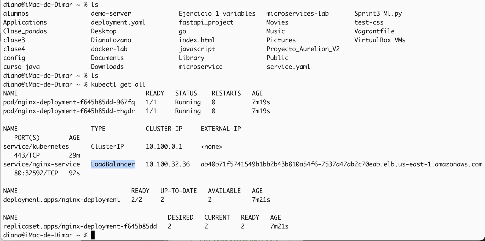

# Laboratorio: Orquestación de Kubernetes con Amazon EKS 🚀

Este proyecto documenta el aprovisionamiento, configuración y despliegue de una arquitectura escalable utilizando **Amazon Elastic Kubernetes Service (EKS)**.

## 🏗️ 1. Aprovisionamiento del Clúster
Utilicé la herramienta `eksctl` para crear un clúster gestionado de forma declarativa. Este proceso automatizó la creación de la VPC, las subredes y el despliegue de dos instancias `t3.medium` como nodos de trabajo (Data Plane).

**Evidencias de creación:**

---

## 🚥 2. Configuración de Métricas y Acceso
Para habilitar el autoescalado, instalé el **Metrics Server**. Fue necesario aplicar parches al despliegue para permitir la comunicación segura (`kubelet-insecure-tls`) y ajustar las etiquetas, asegurando que el API Server recolectara métricas de CPU y memoria correctamente.

**Evidencias técnicas:**

---

## 🌐 3. Desacoplamiento de Configuración (ConfigMaps)
Implementé una página web personalizada inyectándola como un volumen mediante un **ConfigMap**. Esta estrategia permite desacoplar el contenido del sitio de la imagen de Nginx, facilitando actualizaciones rápidas sin necesidad de realizar nuevos despliegues de contenedores.

**Detalles del ConfigMap:**

---

## 🚀 4. Despliegue y Balanceo (NLB)
Desplegué la aplicación utilizando un servidor **Nginx**. Expuse el servicio mediante un **Network Load Balancer (NLB)** de AWS, configurado mediante anotaciones en el manifiesto de Kubernetes, permitiendo tráfico de alta disponibilidad en la Capa 4.

**Estado del despliegue:**

!https://www.wordreference.com/sinonimos/exitoso(./img/URL_cluster_exitoso.png)

---

## 📈 5. Autoescalado Horizontal (HPA) y Prueba de Estrés
Configuré el **Horizontal Pod Autoscaler (HPA)** con un umbral del 30% de CPU. Para validar el funcionamiento, ejecuté un script de estrés con múltiples hilos de `curl`, lo que incrementó la carga y forzó al clúster a crear réplicas adicionales de forma dinámica.

**Evidencia de escalado:**

---

## 👁️ 6. Observabilidad y Add-ons
Para la supervisión final, validé el estado de los componentes esenciales y complementos (add-ons) necesarios para la red y el descubrimiento de servicios dentro del clúster.

**Evidencia de componentes:**

---

## 📝 Conclusiones Finales

1.  **Orquestación Eficiente:** Amazon EKS reduce la carga operativa de gestionar el Control Plane, permitiendo centrarse en la configuración del Data Plane y la aplicación.
2.  **Escalabilidad Dinámica:** La integración de Metrics Server con HPA demuestra la resiliencia de Kubernetes para adaptarse a demandas de tráfico variables en tiempo real.
3.  **Seguridad y Accesos:** La resolución de problemas mediante parches y la configuración de entradas de acceso IAM son pasos críticos para garantizar la estabilidad de un entorno productivo.

---
**Desarrollado por:** Diana Marcela Lozano Zarate
