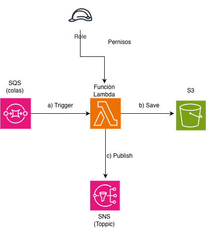
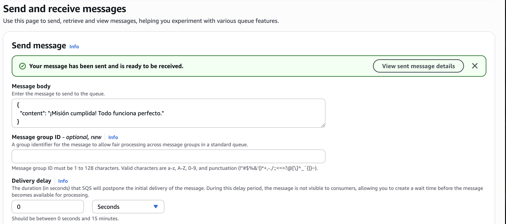
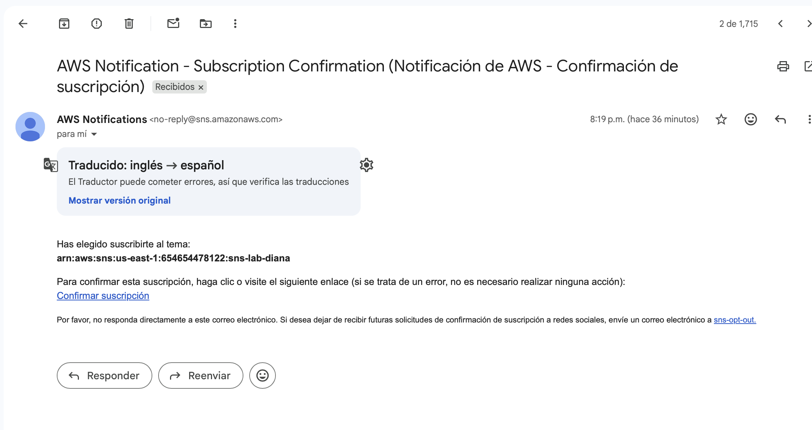
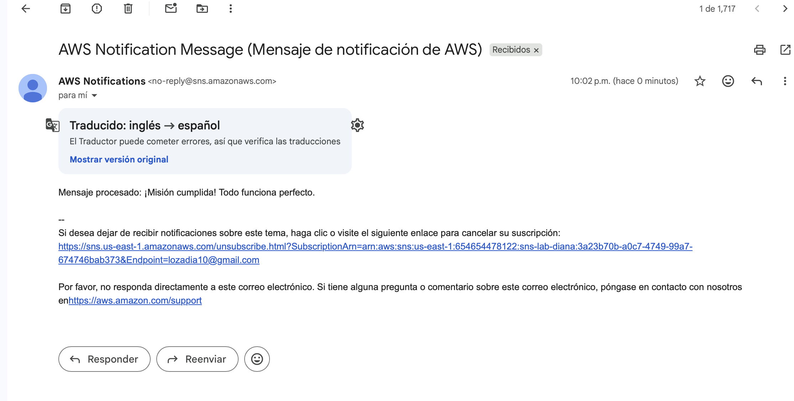

# Reporte de Laboratorio: Desacoplamiento en AWS

## 1. Objetivo del Laboratorio
El objetivo de esta práctica fue diseñar e implementar una arquitectura orientada a eventos en Amazon Web Services (AWS). Se buscó automatizar el procesamiento de mensajes desde una cola, almacenarlos de forma persistente y notificar al usuario final mediante correo electrónico, validando el flujo completo de datos y los permisos de seguridad (IAM).

## 2. Diagrama de la Arquitectura
La solución utiliza un modelo desacoplado donde cada componente cumple una función específica, conectados a través de disparadores (triggers) y políticas de acceso.

### Componentes:
* **Amazon SQS (Simple Queue Service):** Punto de entrada que recibe y almacena los mensajes.
* **AWS Lambda:** Función encargada de procesar el mensaje, realizar la lógica de guardado y disparar la notificación.
* **Amazon S3:** Repositorio donde se almacena el mensaje procesado en formato `.json`.
* **Amazon SNS (Simple Notification Service):** Servicio de mensajería que distribuye la notificación al correo suscrito.
* **IAM Role:** Define los permisos necesarios para que la Lambda interactúe con los demás servicios.

---

## 3. Implementación y Pruebas

### 3.1. Envío del Mensaje de Prueba
Se realizó una prueba enviando un mensaje JSON a través de la consola de SQS para activar el disparador de la función Lambda.

### 3.2. Configuración de la Suscripción (SNS)
Para garantizar la entrega del mensaje, se configuró una suscripción de tipo Email en SNS, la cual requirió una validación de seguridad por parte del usuario.

---

## 4. Resultados Finales
Tras la ejecución exitosa de la función Lambda, se validaron los dos resultados esperados:
1.  **Persistencia:** El archivo se creó correctamente en el bucket de S3.
2.  **Notificación:** Se recibió el mensaje procesado en la bandeja de entrada del correo electrónico configurado.

## 5. Conclusiones
* Se logró integrar exitosamente servicios de cómputo, mensajería y almacenamiento.
* Se validó la importancia de las políticas de IAM para permitir la comunicación entre servicios.
* La arquitectura implementada es altamente escalable y eficiente, cumpliendo con los estándares de soluciones Cloud Native.