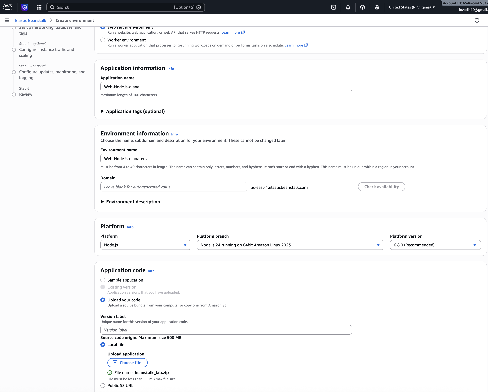
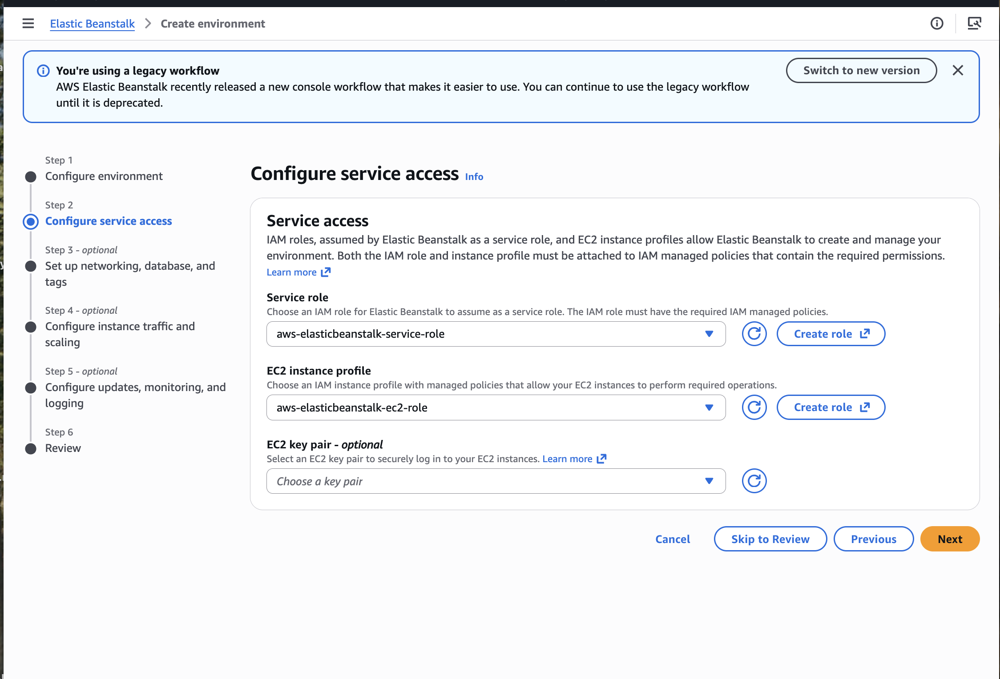
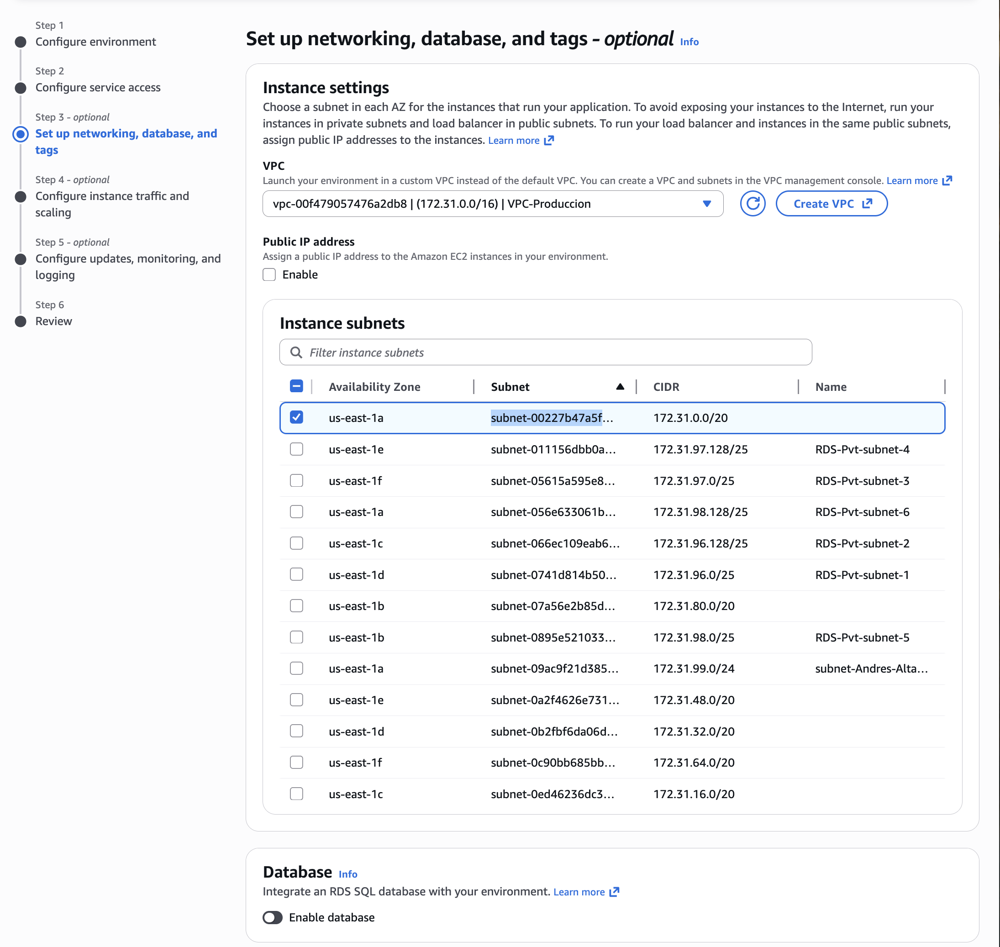
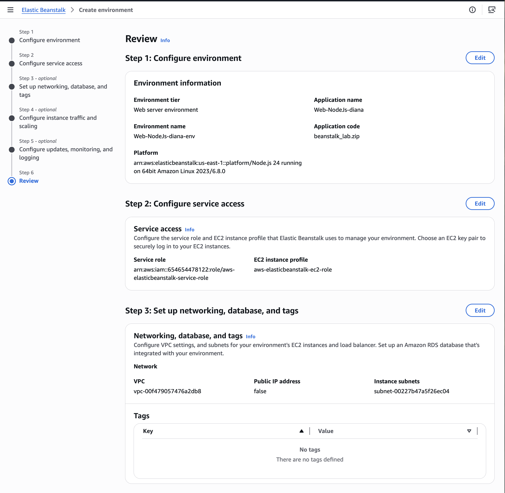
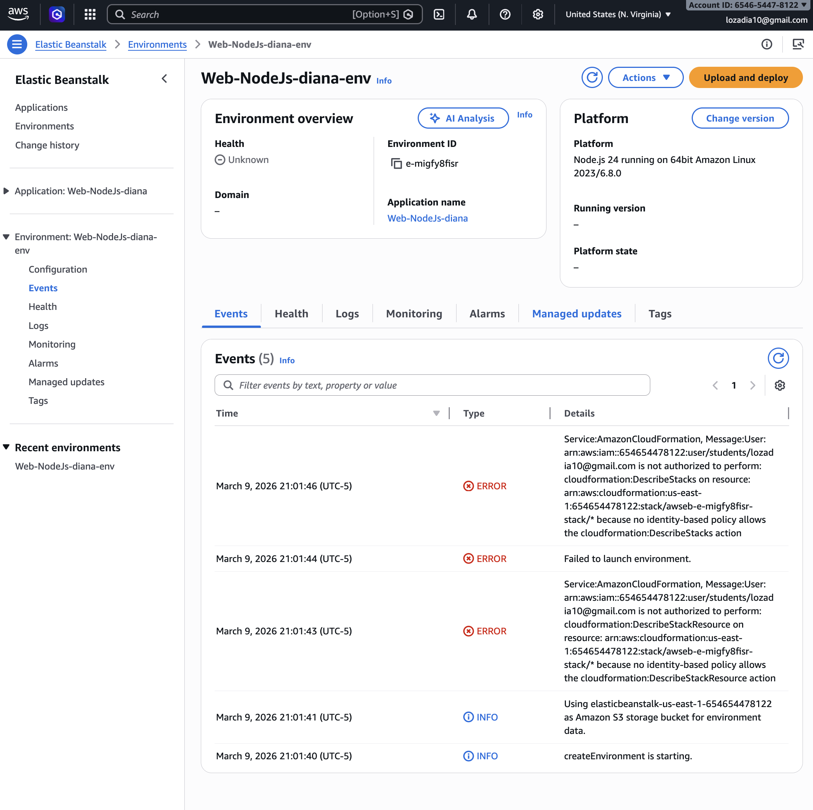

# 🚀 Laboratorio AWS: Despliegue de Aplicaciones con AWS Elastic Beanstalk

Este laboratorio documenta el proceso de despliegue de una aplicación web utilizando **AWS Elastic Beanstalk**. El objetivo principal fue implementar una solución de **PaaS (Platform as a Service)** que permitiera el despliegue automatizado de una aplicación en Node.js, gestionando la infraestructura, el balanceo de carga y el escalado de forma transparente.

---

## 🏗️ 1. Configuración del Entorno y Aplicación
Inicié el proceso definiendo el nombre de la aplicación `Web-NodeJs-diana` y el entorno `Web-NodeJs-diana-env`. Opté por cargar el código fuente directamente mediante un archivo local llamado `beanstalk_lab.zip`.

> **Evidencia de configuración inicial:**
> 

---

## 🛡️ 2. Gestión de Accesos y Roles (IAM)
Para el correcto funcionamiento de Elastic Beanstalk, configuré los roles de servicio necesarios:
* **Service Role:** `aws-elasticbeanstalk-service-role` para que Beanstalk gestione los recursos en mi nombre.
* **EC2 Instance Profile:** `aws-elasticbeanstalk-ec2-role` para otorgar permisos a las instancias que ejecutan la aplicación.

> **Evidencia de Roles:**
> 

---

## 🌐 3. Networking e Infraestructura
Establecí la red dentro de la VPC de producción (`VPC-Produccion`) y seleccioné una subnet pública para el despliegue de las instancias. Además, configuré la capacidad del entorno como **Single Instance** (instancia única) utilizando tipos `t3.micro` y `t3.small` para optimizar costos de laboratorio.

> **Evidencia de Red:**
> 
> 

---

## 🔍 4. Monitoreo y Solución de Problemas
Durante el despliegue, enfrenté y analicé errores de permisos relacionados con **CloudFormation** y **IAM** (errores de "Not Authorized"). Esto me permitió profundizar en la importancia de tener políticas de identidad correctamente vinculadas para que Beanstalk pueda orquestar el stack tecnológico completo.

> **Evidencia de Eventos y Errores:**
> 

---

## 📝 Conclusiones Finales

* **Simplicidad de Despliegue:** Comprendí cómo Elastic Beanstalk abstrae la complejidad de configurar balanceadores y grupos de autoescalado, permitiendo enfocarse en el código.
* **Gobierno de Accesos:** La práctica me enseñó que un despliegue exitoso depende críticamente de la correcta configuración de roles de IAM y permisos de CloudFormation.
* **Observabilidad:** Aprendí a utilizar el panel de eventos para diagnosticar fallos en tiempo real y entender el flujo de creación de recursos en segundo plano.
