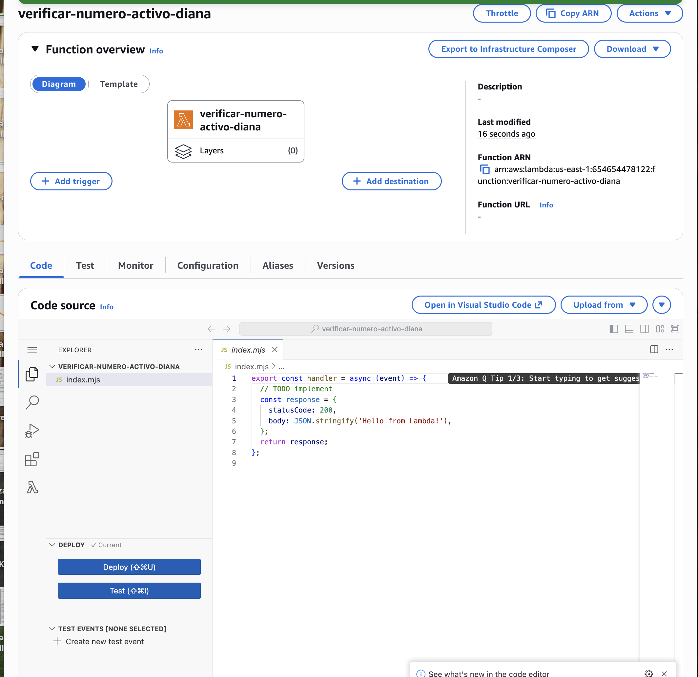
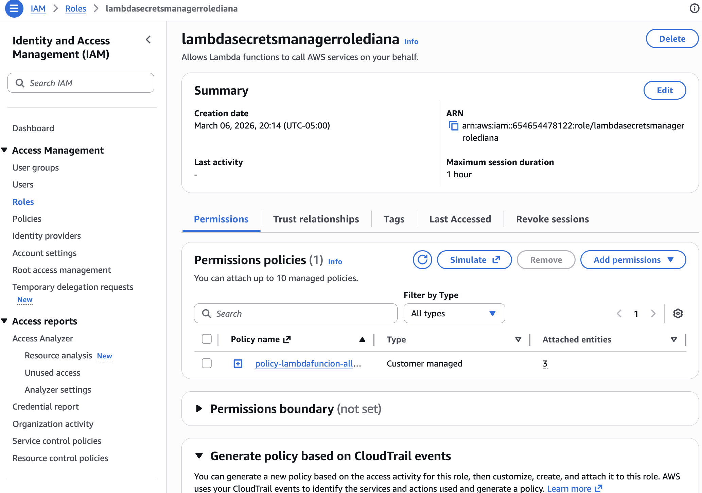
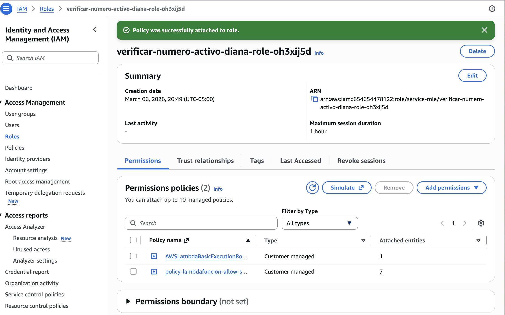
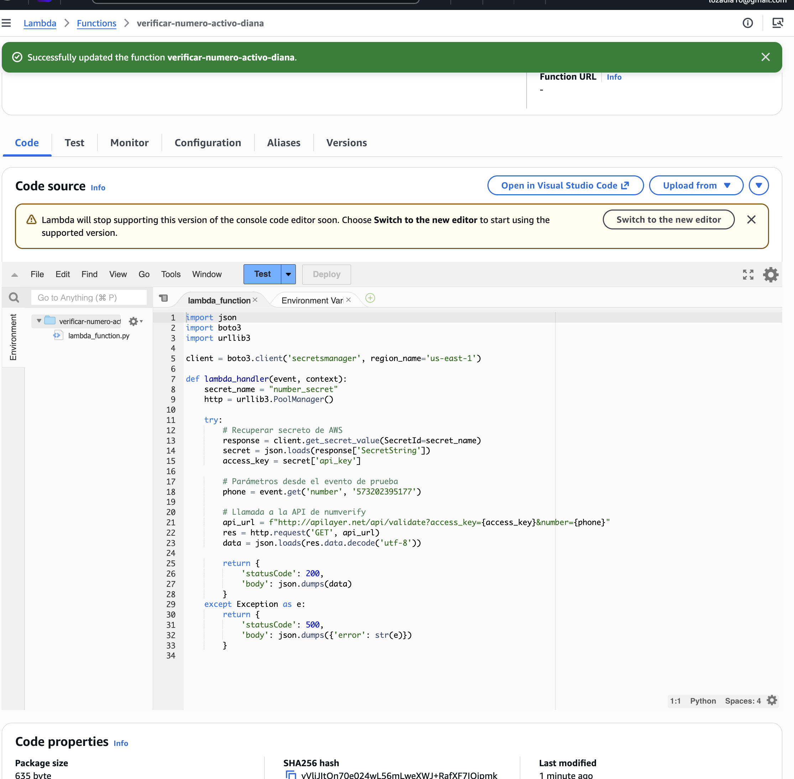
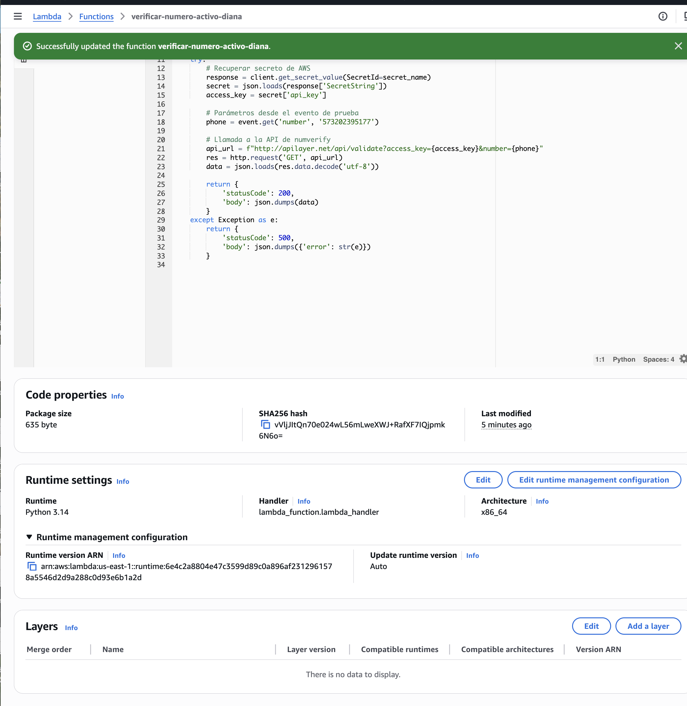

# ƛ Laboratorio AWS: Automatización con AWS Lambda 

Este laboratorio documenta la implementación de una arquitectura **Serverless** utilizando **AWS Lambda**. El objetivo principal fue crear una función capaz de ejecutar lógica de negocio bajo demanda, gestionando de forma segura información sensible mediante la integración con **IAM** y **AWS Secrets Manager**.

* **Servicios Utilizados:** AWS Lambda, IAM (Roles & Policies), AWS Secrets Manager.

---

## 🏗️ 1. Creación de la Función Lambda
Inicié el proceso creando una función denominada `verificar-numero-activo-diana`. Esta función fue configurada para ejecutarse en un entorno de **Python 3.14**, permitiendo procesar solicitudes sin la necesidad de aprovisionar o gestionar servidores físicos.

> **Evidencia de creación:**
> 

---

## 🛡️ 2. Gestión de Identidad y Accesos (IAM)
Para garantizar que la función operara bajo los estándares de seguridad de AWS, configuré roles de ejecución específicos.

### 2.1. Configuración del Role de Servicio
Creé el rol de IAM denominado `lambdasecretsmanagerrolediana`. Este rol permite que la función Lambda realice llamadas a otros servicios de AWS en mi nombre de manera controlada.

> **Evidencia de IAM Role:**
> 

### 2.2. Asociación de Políticas de Permisos
Asocié políticas personalizadas al rol para cumplir con el principio de mínimo privilegio. Esto asegura que la función solo tenga acceso a los recursos y secretos indispensables para su ejecución exitosa.

> **Evidencia de Políticas vinculadas:**
> 

---

## 🔐 3. Lógica de Programación e Integración con Secrets Manager
Implementé un script en Python utilizando la librería `boto3` para interactuar con la infraestructura de AWS de forma programática.

### 3.1. Desarrollo del Código y Manejo de Secretos
La función fue diseñada para recuperar un secreto llamado `number_secret` desde **AWS Secrets Manager**. Al extraer la `api_key` de forma dinámica, logré realizar peticiones seguras a una API externa de validación de números sin exponer credenciales críticas dentro del código fuente.

> **Evidencia del Código Fuente:**
> 

### 3.2. Configuración del Entorno (Runtime)
Ajusté el entorno de ejecución para asegurar la compatibilidad con las librerías necesarias y optimizar el tiempo de respuesta de la función.

> **Evidencia de Configuración:**
> 

---

## 📝 Conclusiones Finales

* **Eficiencia Serverless:** Comprendí la potencia de desplegar lógica de backend que escala automáticamente, eliminando la sobrecarga operativa de gestionar infraestructura.
* **Seguridad por Diseño:** La integración con **Secrets Manager** y la gestión granular de **IAM** me permitieron aprender a manejar datos sensibles siguiendo las mejores prácticas de la industria.
* **Orquestación en la Nube:** Aprendí a utilizar `boto3` para conectar diferentes servicios de AWS, permitiendo crear flujos de trabajo automatizados, seguros y altamente eficientes.

