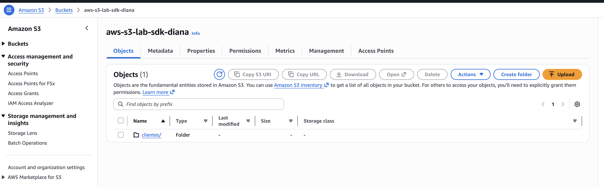
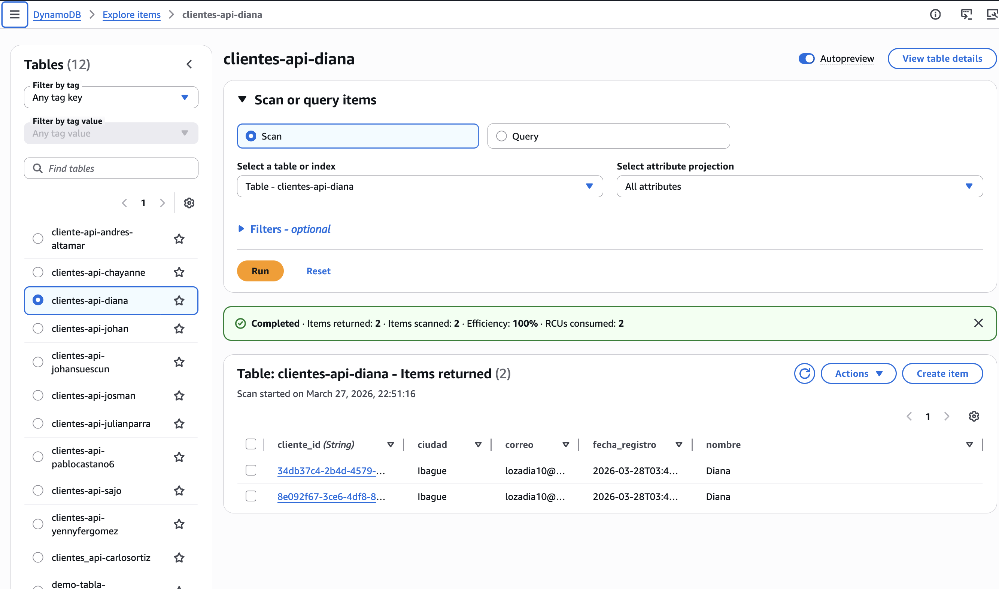
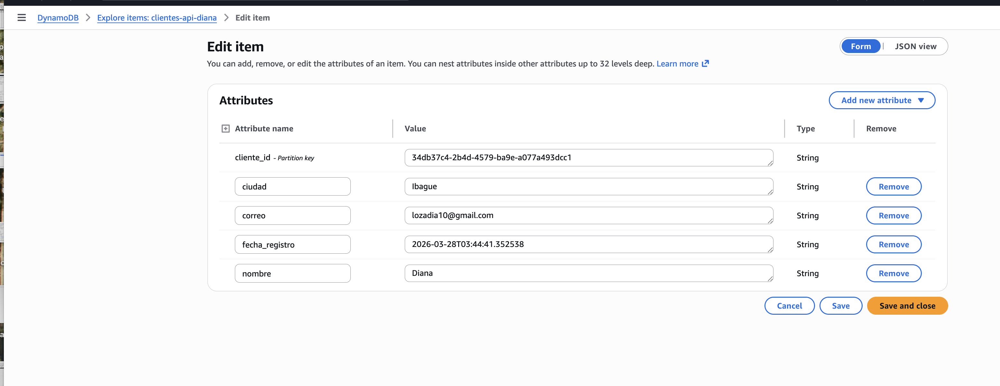
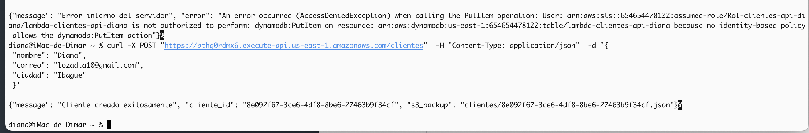
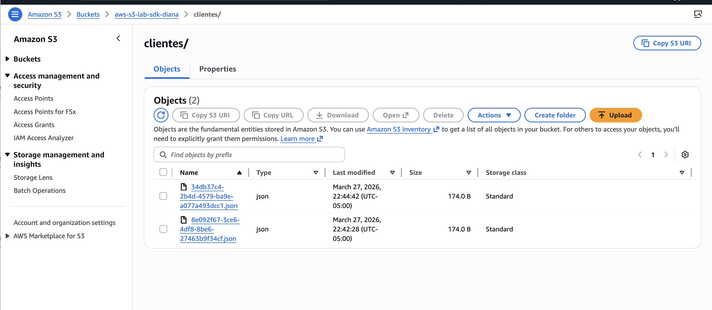
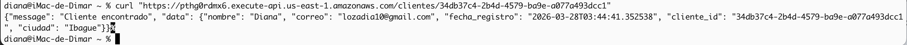

# ☁️ Laboratorio AWS: Desarrollo Serverless con SDK, DynamoDB y S3

Este laboratorio documenta la implementación técnica de una aplicación **Serverless** utilizando el SDK de AWS para Python (**boto3**). El desarrollo se centró en la creación de un flujo automatizado para el registro de datos en una base de datos NoSQL y la generación simultánea de respaldos en archivos físicos.

* **Servicios Utilizados:** AWS Lambda, Amazon DynamoDB, Amazon S3, API Gateway, Boto3 SDK.

---

## 🏗️ 1. Configuración de la Infraestructura de Almacenamiento
El primer paso consistió en preparar los servicios que recibirían la información procesada por la lógica de negocio.

### 1.1. Amazon S3 (Capa de Respaldos)
Creé el bucket denominado `aws-s3-lab-sdk-diana` con una estructura de carpetas diseñada para organizar los respaldos de clientes en formato JSON.

> **Evidencia:**
> 

### 1.2. Amazon DynamoDB (Capa de Persistencia)
Configuré una tabla denominada `clientes-api-diana` utilizando `cliente_id` como clave de partición (Partition Key) para asegurar búsquedas eficientes y escalables.

> **Evidencia:**
> 

---

## 🛡️ 2. Desarrollo de la Lógica de Negocio (Lambda & Boto3)
Implementé una función Lambda en **Python 3.12** utilizando el SDK oficial de AWS para interactuar programáticamente con la infraestructura.

### 2.1. Gestión de Permisos (IAM)
Asocié políticas de ejecución que permitieron a la función realizar operaciones de escritura (`PutItem`) en DynamoDB y de carga de objetos (`PutObject`) en S3, garantizando la seguridad mediante el principio de mínimo privilegio.

### 2.2. Implementación del Código
El script desarrollado realiza la recepción de datos vía HTTP, valida los campos obligatorios y orquesta el almacenamiento doble:
* **Persistencia:** Guarda los atributos del cliente directamente en la tabla de DynamoDB.
* **Respaldo:** Genera un archivo `.json` y lo carga en la carpeta correspondiente del bucket S3.

> **Evidencia de Item Registrado:**
> 

---

## 🚀 3. Integración y Pruebas Funcionales
Utilicé **API Gateway** para exponer los endpoints y realicé la validación del sistema completo mediante herramientas de terminal.

### 3.1. Prueba de Registro (Método POST)
Ejecuté una petición POST exitosa. Durante el desarrollo, se identificó y solucionó un error de autorización inicial, validando la importancia de la correcta configuración de las políticas de IAM para el acceso a recursos.

> **Evidencia de Registro Exitoso:**
> 

### 3.2. Verificación de Respaldo y Consulta (GET)
Confirmé la generación automática de los archivos de respaldo en S3 y validé la recuperación de la información mediante una petición GET.

> **Evidencias de Validación:**
> 
> 

---

* **Automatización con SDK:** El uso de **Boto3** permitió una integración fluida y eficiente entre servicios, eliminando la necesidad de gestionar conexiones complejas manualmente.
* **Resiliencia de Datos:** La implementación de una arquitectura que combina bases de datos con respaldos en archivos físicos (S3) asegura la disponibilidad y recuperación de la información.
* **Depuración Técnica:** La resolución de errores de acceso durante las pruebas de integración fortaleció mis conocimientos sobre el gobierno de identidades y accesos en entornos productivos de AWS.

